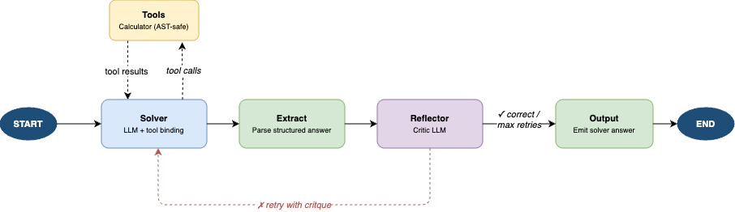
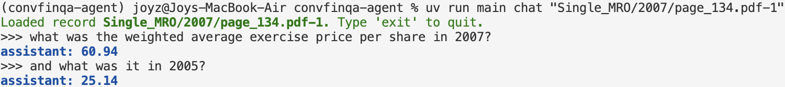

# Conversational Financial Q&A Agent

A multi-agent system for conversational financial question answering over structured financial documents (tables + text). Built on [ConvFinQA](https://github.com/czyssrs/ConvFinQA) — a public dataset of annotated multi-turn conversations grounded in real earnings reports.

## Background and Goal

Financial documents contain tables, pre-text, and post-text that require multi-step arithmetic reasoning across conversation turns. The goal is to build an agent that can answer follow-up questions accurately, where each answer may depend on prior turns in the conversation.

This project explores three agent architectures of increasing complexity, evaluated on execution accuracy against ground-truth numeric answers.

## Agent Architecture

The final framework is built with LangGraph with two agent nodes: a **Solver** agent that reasons and computes over the document, equiped with a calculator tool, and a **Reflector** agent that either approves the answer or sends it back to the Solver with a critique for retry.

[](figures/final_architecture.drawio.png)

## Code Structure

```
config/                     # Externalized config — adjust without touching code
├── agent.yaml                  # Reflection retry limit, calculator call budget
├── llm.yaml                    # Model, temperature, thinking level, timeouts per role
└── prompts.yaml                # Solver and Reflector system prompt templates

src/
├── cli.py                  # CLI entrypoint
├── demo.py                 # Streamlit app for presentation demo
├── data.py                 # Data loading and JSON-to-Markdown document rendering
├── logger.py               # Centralised logging setup
├── agent/                  # Final agent: Solver + Reflector + Calculator
│   ├── agent.py                # LangGraph workflow; initialize_chat / chat_turn interface
│   ├── nodes.py                # All node functions and routing logic
│   ├── state.py                # AgentState TypedDict and structured output schemas
│   ├── tools.py                # AST-safe calculator tool
│   └── settings.py             # Config dataclasses, prompt template loading, LLM factory
|
└── experiments/            # Past experiments of three agent architectures
    ├── evaluation.py           # Async evaluation runner with MLflow tracking
    ├── evaluation_config.py    # Agent registry; swap variants without touching eval code
    └── agent_candidates/
        ├── baseline_agent.py              # Solver only
        ├── reflection_agent.py            # Solver + Reflector
        └── reflection_agent_with_tool.py  # Solver + Calculator + Reflector

figures/                    # Architecture diagrams and evaluation screenshots
tests/                      # Unit tests
data/                       # ConvFinQA data (421 records derived from the raw dataset)
.env.example                # Environment variables — copy to .env and fill in
```

## Setup

**Prerequisites:** Python 3.12+, [uv](https://docs.astral.sh/uv/)

```bash
# Install dependencies
uv sync

# For running evaluations (MLflow tracking)
uv sync --extra experiments
```

**Credentials:** The agent uses Gemini via the Google AI API. Set the following in a `.env` file:

```
GOOGLE_API_KEY=your-google-api-key
```

> **Other providers:** The agent is built on LangChain and LangGraph. Switching to a different model provider (OpenAI, Anthropic, etc.) requires updating [src/agent/settings.py](src/agent/settings.py) ƒor corresponding model.

## Usage

### Chat (CLI)

Ask questions about a specific financial document record:

```bash
uv run main chat <record_id>

# Example
uv run main chat "Single_MRO/2007/page_134.pdf-1"
```

[](figures/cli_example.png)

### Web Demo (Streamlit)

Browse dev records and chat interactively via a web UI:

```bash
uv run streamlit run src/demo.py
```

### Tests

```bash
uv run pytest -v
```

Integration tests (LLM calls) are skipped automatically if credentials are not configured.